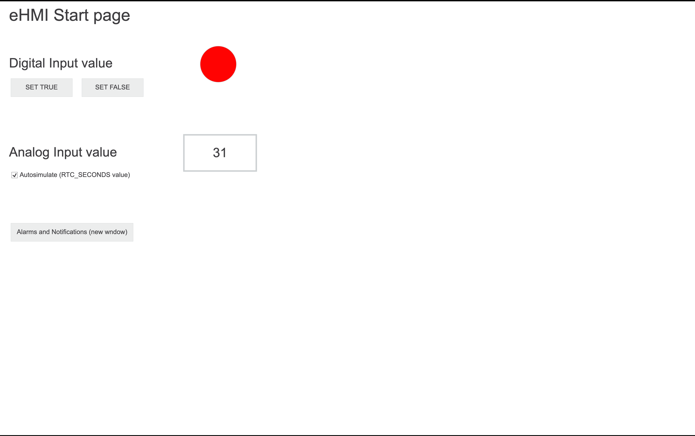

# PLCnext Datalogger Web App
Web app to access data from PLCnext Datalogger database

## In Russian
[In English ↓](#in-english)

### Описание
Приложение предназначено для контроллеров на базе [PLCnext Technology](https://www.phoenixcontact.com/plcnext/) и
предназначено для доступа и отображения на Web-интерфейсе контроллера значений из базы данных даталоггера и нотификаций.

Приложение работает в [Balena Engine](https://www.balena.io/engine/) контейнере. Во время установки контроллер должен
иметь активное интернет-подключение.

### Конфигурация даталоггера
- Ознакомьтесь с [информацией о работе даталоггера](http://plcnext-infocenter.s3-website.eu-central-1.amazonaws.com/PLCnext_Technology_InfoCenter/PLCnext_Technology_InfoCenter/Service_Components/DataLogger/DataLogger.htm?d_f=false)
- Загрузите файл конфигурации [data-logger.config](/config/Services/DataLogger/data-logger.config) в контроллер по SFTP
```
user@unix-machine:~# scp config/Services/DataLogger/data-logger.config admin@192.168.1.10:/opt/plcnext/projects/Services/DataLogger/data-logger.config
```

### Загрузка проекта PLCnext Engineer
- Откройте и [загрузите](https://github.com/savushkin-r-d/PLCnext-howto/tree/master/HowTo%20quick%20start%20AXC%20F%202152%20and%20PLCnext%20Engineer)
в контролллер [файл проекта PLCnext Engineer](/PLCnext%20Engineer/src)

### Установка Balena Engine
- Следуйте [инструкции](https://github.com/PLCnext/Docker_GettingStarted/blob/master/getting-started/Part-01/README.md)
- Измените файл `/etc/nftables/balena.nft` в соответствии с подсетью интерфейса `balena0`
```
root@axcf2152:/opt/plcnext/# ifconfig
balena0   Link encap:Ethernet  HWaddr 02:42:B7:8F:11:70
          inet addr:172.17.0.1  Bcast:172.17.255.255  Mask:255.255.0.0
          inet6 addr: fe80::42:b7ff:fe8f:1170/64 Scope:Link
          UP BROADCAST MULTICAST  MTU:1500  Metric:1
          RX packets:411 errors:0 dropped:0 overruns:0 frame:0
          TX packets:37 errors:0 dropped:0 overruns:0 carrier:0
          collisions:0 txqueuelen:0
          RX bytes:26172 (25.5 KiB)  TX bytes:2634 (2.5 KiB)


root@axcf2152:/opt/plcnext/# nano /etc/nftables/balena.nft

#!/usr/sbin/nft -f
define balena_v4 = 172.17.0.0/24

table ip balena {
  chain balena_forward {
    # default forward policy is drop
    type filter hook forward priority 0; policy drop;
    ip saddr $balena_v4 oif eth0 accept
    # accept any established connection traffic
    ct state established,related accept
  }

  chain prerouting {
    type nat hook prerouting priority 0;
  }

  chain postrouting {
    type nat hook postrouting priority 0;
    # apply source nat for balena traffic to the internet
    ip saddr $balena_v4 oif eth0 masquerade
  }
}
```
- Если активирован Firewall, откройте для приложения входящий порт (по-умолчанию 3000)
    - Через [страницу на Web интерфейсе](https://192.168.1.10/wbm/Main.html#Firewall.html)
    - Через [файл конфигурации](https://github.com/PLCnext/Docker_GettingStarted/tree/master/getting-started/Part-02)

- Запустите контейнер
```
balena-engine run -d \
    --name=plcnext-datalogger-web-app \
    --restart=always \
    -p 3000:3000 \
    --volume /opt/plcnext/projects/plcnext-datalogger-web-app/:/usr/app/database/:ro \
    --volume /opt/plcnext/logs/:/usr/app/logs/:ro \
    --env DL_DB_FILE_PATH=/usr/app/database/database-web-app.db \
    --env LOGS_DB_FILE_PATH=/usr/app/logs/default.sqlite \
    axhelp/plcnext-datalogger-web-app:latest
```

Контейнеру необходим read-only доступ к двум директориям:
- Директория с базой данных даталлоггера `/opt/plcnext/projects/plcnext-datalogger-web-app/`, либо другая определенная в
файле конфигурации [data-logger.config](/config/Services/DataLogger/data-logger.config)
- Стандартная директория с базой данных нотификаций `/opt/plcnext/logs/`

### Web интерфейс
- Зайдите на eHMI start page по адресу [http://192.168.1.10/](http://192.168.1.10/). Можно задать значения симуляции для дискретного и аналогового входов, и перейти на страницу `Alarms and Notifications`. 



- Или перейдите на Web-интерфейс приложения по прямому адресу [http://192.168.1.10:3000/](http://192.168.1.10:3000/)


### Известные проблемы
- Не загружаются файлы стилей. Приложение использует файлы [pxc_device.css](https://192.168.1.10/wbm/pxc_device.css) и
[pxc_styles.css](https://192.168.1.10/wbm/pxc_styles.css) встроенного Web-сервера, которые доступны только по HTTPS.
Разрешите браузеру использовать самоподписанный сертификат устройства.

### Обновление приложения
- Загрузка, обновление, удаление больше не используемых образов и контейнеров
```
# Pull image from Docker Hub
balena-engine pull axhelp/plcnext-datalogger-web-app:latest
balena-engine stop plcnext-datalogger-web-app
balena-engine rm plcnext-datalogger-web-app

# Re-create container
# (command from previous step)

# Remove unused images and containers
balena-engine system prune -a
```

### Разработка
- Запуск NodeJS / React приложения локально
```
cd server/
npm install
npm run start:dev

cd ../frontend/
npm install
npm run start
```

- Билд контейнера локально
```
docker build --tag plcnext-datalogger-web-app:dev .

docker run --rm \
   --name=plcnext-datalogger-web-app \
   -p 3000:3000 \
   --volume ~/axhelp/plcnext-datalogger-web-app/databases/:/usr/app/database/:ro \
   --volume ~/axhelp/plcnext-datalogger-web-app/databases/:/usr/app/logs/:ro \
   --env DL_DB_FILE_PATH=/usr/app/database/database-web-app.db \
   --env LOGS_DB_FILE_PATH=/usr/app/logs/default.sqlite \
   --env NODE_ENV=development \
   plcnext-datalogger-web-app:dev
```


## In English
[На русском ↑](#in-russian)

### Overview
Application is intended to run on [PLCnext Technology](https://www.phoenixcontact.com/plcnext/) based PLC's from
Phoenix Contact and can be used to access and display on PLC's Web interface data values from firmware-based
datalogger and notifications databases.

Application is running inside [Balena Engine](https://www.balena.io/engine/) container. PLC should have an active
internet connection during the installation procedure.

### Datalogger configuration
- Take a look into [data logging concept](http://plcnext-infocenter.s3-website.eu-central-1.amazonaws.com/PLCnext_Technology_InfoCenter/PLCnext_Technology_InfoCenter/Service_Components/DataLogger/DataLogger.htm?d_f=false)
- Download configuration file [data-logger.config](/config/Services/DataLogger/data-logger.config) into PLC over SFTP
```
user@unix-machine:~# scp config/Services/DataLogger/data-logger.config admin@192.168.1.10:/opt/plcnext/projects/Services/DataLogger/data-logger.config
```

### Download PLCnext Engineer project
- Open and [download](https://github.com/savushkin-r-d/PLCnext-howto/tree/master/HowTo%20quick%20start%20AXC%20F%202152%20and%20PLCnext%20Engineer)
into PLC [PLCnext Engineer project](/PLCnext%20Engineer/src)

### Balena Engine installation
- Follow [instruction](https://github.com/PLCnext/Docker_GettingStarted/blob/master/getting-started/Part-01/README.md)
- Change configuration file `/etc/nftables/balena.nft` according to subnet of `balena0` network interface
```
root@axcf2152:/opt/plcnext/# ifconfig
balena0   Link encap:Ethernet  HWaddr 02:42:B7:8F:11:70
          inet addr:172.17.0.1  Bcast:172.17.255.255  Mask:255.255.0.0
          inet6 addr: fe80::42:b7ff:fe8f:1170/64 Scope:Link
          UP BROADCAST MULTICAST  MTU:1500  Metric:1
          RX packets:411 errors:0 dropped:0 overruns:0 frame:0
          TX packets:37 errors:0 dropped:0 overruns:0 carrier:0
          collisions:0 txqueuelen:0
          RX bytes:26172 (25.5 KiB)  TX bytes:2634 (2.5 KiB)


root@axcf2152:/opt/plcnext/# nano /etc/nftables/balena.nft

#!/usr/sbin/nft -f
define balena_v4 = 172.17.0.0/24

table ip balena {
  chain balena_forward {
    # default forward policy is drop
    type filter hook forward priority 0; policy drop;
    ip saddr $balena_v4 oif eth0 accept
    # accept any established connection traffic
    ct state established,related accept
  }

  chain prerouting {
    type nat hook prerouting priority 0;
  }

  chain postrouting {
    type nat hook postrouting priority 0;
    # apply source nat for balena traffic to the internet
    ip saddr $balena_v4 oif eth0 masquerade
  }
}
```

- Run container
```
balena-engine run -d \
    --name=plcnext-datalogger-web-app \
    --restart=always \
    -p 3000:3000 \
    --volume /opt/plcnext/projects/plcnext-datalogger-web-app/:/usr/app/database/:ro \
    --volume /opt/plcnext/logs/:/usr/app/logs/:ro \
    --env DL_DB_FILE_PATH=/usr/app/database/database-web-app.db \
    --env LOGS_DB_FILE_PATH=/usr/app/logs/default.sqlite \
    axhelp/plcnext-datalogger-web-app:latest
```

Container should have an access to the following directories as read-only volumes:
- DataLogger directory `/opt/plcnext/projects/plcnext-datalogger-web-app/`, or another defined in the
configuration file [data-logger.config](/config/Services/DataLogger/data-logger.config)
- Standard directory with notifications database `/opt/plcnext/logs/`

### Web-interface
- Visit PLC eHMI start page via address [http://192.168.1.10/](http://192.168.1.10/). There you can simulate digital and analog input values and navigate to `Alarms and Notifications` page. 


- Or visit app web interface directly via address [http://192.168.1.10:3000/](http://192.168.1.10:3000/)


### Knowing issues
- Broken styles. Application is using styles files [pxc_device.css](https://192.168.1.10/wbm/pxc_device.css) and
[pxc_styles.css](https://192.168.1.10/wbm/pxc_styles.css) from embedded web-server, which are accessible only by HTTPS.
Accept self-signed certificate with your browser by visiting main page [https://192.168.1.10](https://192.168.1.10)

### Application update

- App update and clean unused images
```
# Pull image from Docker Hub
balena-engine pull axhelp/plcnext-datalogger-web-app:latest
balena-engine stop plcnext-datalogger-web-app
balena-engine rm plcnext-datalogger-web-app

# Re-create container
# (command from previous step)

# Remove unused images and containers
balena-engine system prune -a
```

### Development
- Run NodeJS / React app locally on dev machine
```
cd server/
npm install
npm run start:dev

cd ../frontend/
npm install
npm run start
```

- Build and run container locally on dev machine
```
docker build --tag plcnext-datalogger-web-app:dev .

docker run --rm \
   --name=plcnext-datalogger-web-app \
   -p 3000:3000 \
   --volume ~/axhelp/plcnext-datalogger-web-app/databases/:/usr/app/database/:ro \
   --volume ~/axhelp/plcnext-datalogger-web-app/databases/:/usr/app/logs/:ro \
   --env DL_DB_FILE_PATH=/usr/app/database/database-web-app.db \
   --env LOGS_DB_FILE_PATH=/usr/app/logs/default.sqlite \
   --env NODE_ENV=development \
   plcnext-datalogger-web-app:dev
```
